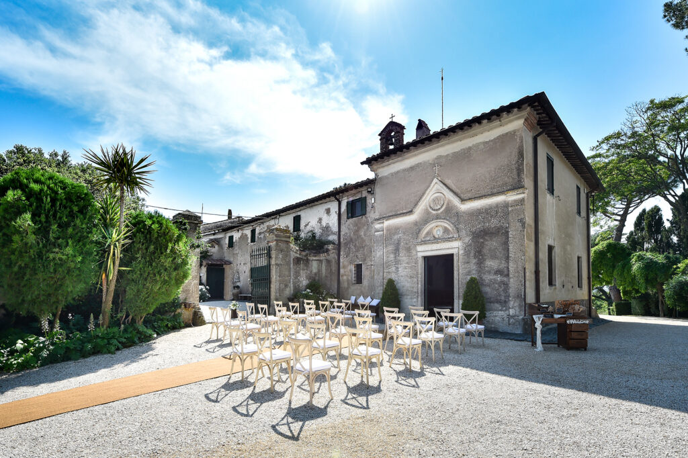
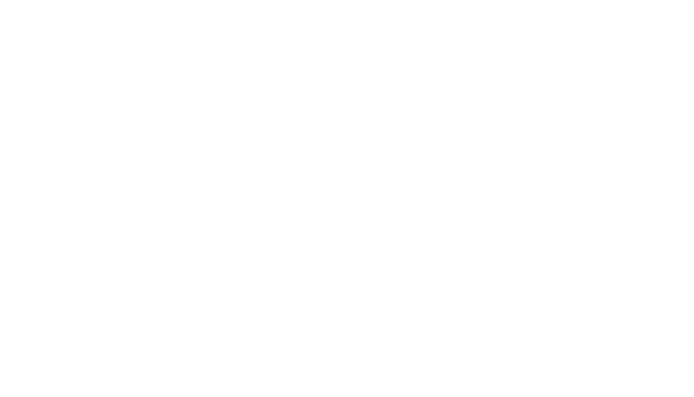

## Il Casale di Polline

✨ Immaginate un luogo sospeso tra cielo e lago, dove la natura accoglie ogni dettaglio con poesia.   

A pochi passi da Roma, su una collina affacciata sul lago di Bracciano, sorge il **Casale di Polline**: una masseria del XVII secolo trasformata in un’oasi romantica e senza tempo… ma raggiungerla, beh, è stata tutta un’avventura! 😅   

<!-- Messi da parte i soliti dubbi (☔️?) ci siamo detti che nel giorno del nostro matrimonio avremmo pensato solo ai nostri sogni, alla spensieratezza e all’amore. -->

È qui che festeggeremo il nostro matrimonio, con un pranzo tra ulivi e lavanda 🌿, il taglio della torta al tramonto, e poi via… a ballare fino a sera 💃🕺.    

## RSVP

Curiosi? Continuate a leggere per scoprire tutto e darci conferma della vostra presenza! 💌   

<iframe src="https://docs.google.com/forms/d/e/1FAIpQLSd4htcAA8x0BAkq5fsD3Mt9UBdw-orBLfpzjLu6fYH9VdkCAg/viewform?embedded=true" width="100%" height="1000" frameborder="0" marginheight="0" marginwidth="0">Loading…</iframe>

## Come arrivare

La prima volta che siamo venuti qui, è stato amore a prima vista ❤️. Così abbiamo scelto questo posto magico per festeggiare insieme a voi 🎉    

**⚠️ Attenzione ai cartelli!**    

Sul lungolago di Polline vedrete indicazioni per la *Tenuta di Polline*... ma **quella non** è la nostra destinazione 🙈   
- Dovrete invece imboccare una **stradina in salita (Via di Polline)** che porta proprio al **Casale di Polline**.
- L'ultimo tratto è una **strada bianca un po’ accidentata** — nulla di estremo, ma vi consigliamo di andare **piano e con calma**.
- All’arrivo troverete ad accogliervi un **ampio parcheggio custodito**.   

<iframe class="google-map" src="https://www.google.com/maps/embed?pb=!1m18!1m12!1m3!1d2959.2879306889495!2d12.285259512339781!3d42.122718849942046!2m3!1f0!2f0!3f0!3m2!1i1024!2i768!4f13.1!3m3!1m2!1s0x132f45d822a5f541%3A0xfe90560bead04cce!2sCasale%20di%20Polline%201906!5e0!3m2!1sen!2sit!4v1744793484564!5m2!1sen!2sit" style="border:0;" allowfullscreen="" loading="lazy" referrerpolicy="no-referrer-when-downgrade"></iframe>

## Info aggiuntive

Sarete accolti a partire dalle **13:00**.  

Dopo il pranzo seduti 🍽️, verso le **18:00** ci sarà il tanto atteso **taglio della torta** 🍰, e poi... **via con le danze fino al tramonto (e oltre!)**    
<!-- Potremo stare insieme **fino alle 20:30**, tra luci, musica e abbracci 🌅❤️    -->

<!-- Il ricevimento sarà curato da **Natalizi** — storico punto di riferimento per la Capitale da oltre un secolo — quindi sì, siete in ottime mani! 👨‍🍳🍷

 -->
